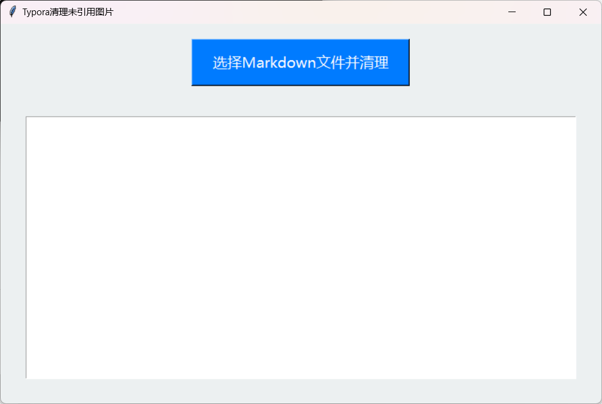

# Typora 清理未引用图片工具

---
相信有些小伙伴在使用Typora或者其他markdown时，没有使用图床的情况下会被没有引用的图片烦扰。所以做了个简单的工具希望对大家有所帮助。

‼️ **前提**：您要在Typora进行如下设置：


确保图片都存储在该文件夹下。

## 工具介绍

### 🚀 功能亮点

**自动清理**：

📌 自动识别 `Markdown` 文件中引用的图片。

📌 清理对应的 `.assets` 文件夹中未被引用的图片。

如图所示：


**安全处理**：

🔧 将未引用的图片移动到 `deleted_images` 文件夹，而非直接删除，避免误删。


**可视化操作**：

📝 提供图形用户界面（GUI），方便用户选择 Markdown 文件。

📝 实时显示操作结果，包括图片总数、删除或移动的图片数量等信息。

## 📦 依赖库

仅需 Python 标准库，无需额外安装！

（Python 3.7+ 环境已包含所有依赖）

## 📦 运行方式

### 方式 1：运行源码

安装 Python 3.7+ 环境。

下载源码文件 `typora_assets_cleaner.py`。

执行命令：

```
python typora\_assets\_cleaner.py
```

## 📝 使用说明

### 1. 界面操作



### 2. 操作步骤

| 步骤               | 操作说明                                                                                                                    |
| ------------------ | --------------------------------------------------------------------------------------------------------------------------- |
| **选择文件** | 点击 “选择 Markdown 文件并清理” 按钮，在弹出的文件选择对话框中选择要处理的 Markdown 文件。                                |
| **查看结果** | 程序会自动检查对应的 `.assets` 文件夹，并将未引用的图片移动到 `deleted_images` 文件夹。操作结果会显示在下方的文本框中。 |

### 3. 注意事项

⚠️ **文件存在性**：确保选择的 Markdown 文件和对应的 `.assets` 文件夹存在。

⚠️ **文件权限**：确保程序有足够的权限访问和移动图片文件。


希望这个工具能帮到您！✨