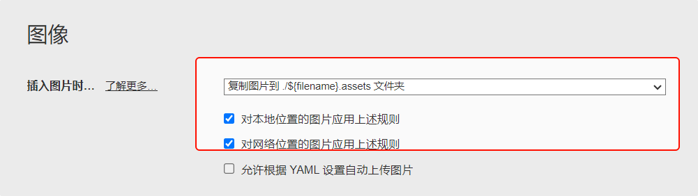

# Typora(Markdown) 清理未引用图片工具

---
相信有些小伙伴在使用Typora或者其他markdown时，没有使用图床的情况下会被没有引用的图片烦扰。所以做了个简单的工具希望对大家有所帮助。

‼️ **前提**：您要在Typora进行如下设置：


确保图片都存储在该文件夹下。

## 工具介绍

### 🚀 功能亮点

**自动清理**：

📌 自动识别 `Markdown` 文件中引用的图片。

📌 清理对应的 `.assets` 文件夹中未被引用的图片。

如图所示：


**安全处理**：

🔧 将未引用的图片移动到 `deleted_images` 文件夹，而非直接删除，避免误删。


**可视化操作**：

📝 提供图形用户界面（GUI），方便用户选择 Markdown 文件。

📝 实时显示操作结果，包括图片总数、删除或移动的图片数量等信息。


## 📦 运行方式

### 方式 1：运行源代码

安装 Python 3.7+ 环境。

下载源码文件 `typora_assets_cleaner.py`。

需安装依赖库`PyQt5`等

执行命令：

```python
python typora\_assets\_cleaner.py
```

### 方式 2：运行exe（推荐）


## 📝 使用说明

### 界面操作


### 操作步骤

| 步骤               | 操作说明                                                                                                                    |
| ------------------ | --------------------------------------------------------------------------------------------------------------------------- |
| **选择文件** | 点击 “选择 Markdown 文件并清理” 按钮，在弹出的文件选择对话框中选择要处理的 Markdown 文件。                                |
| **查看结果** | 程序会自动检查对应的 `.assets` 文件夹，并将未引用的图片移动到 `deleted_images` 文件夹。操作结果会显示在下方的文本框中。 |


1. **操作日志**，你可以看到照片的处理过程，这里支持的图片格式包括`png`、`jpg`、`jpeg`等，程序先创建文件夹asset_images，将未引用的图片都移入该文件夹中，而不是直接丢进回收站，方便用户在后期处理。
2. **图片预览**：这里你可以看到markdown文件未引用的图片和引用的图片，双击图片可以放大查看。
3. **打开.assets文件夹**：在这里，你将看到你所打开的md文件所在文件夹，在此文件夹下，存在`filename.assets`文件夹和`deleted.assets`文件夹。


### 3. 注意事项

⚠️ **文件存在性**：确保选择的 Markdown 文件和对应的 `.assets` 文件夹存在。

⚠️ **文件权限**：确保程序有足够的权限访问和移动图片文件。


打包命令：

```shell
nuitka --onefile --windows-icon-from-ico=icon.ico --enable-plugin=tk-inter --output-filename=typora_assets_cleaner.exe typora_assets_cleaner.py
```

希望这个工具能帮到您！

